<h1 align="center">
  <picture>
    <source media="(prefers-color-scheme: dark)" srcset="docs/brand/nivaroos-logo-white.svg">
    <source media="(prefers-color-scheme: light)" srcset="docs/brand/nivaroos-logo.svg">
    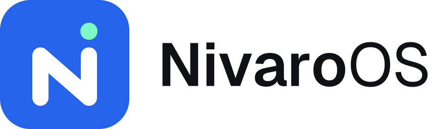
  </picture>
</h1>

<p align="center">
  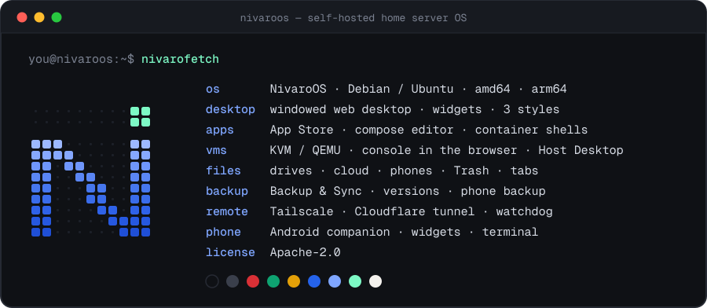
</p>

<p align="center">
  <strong>A self-hosted home server OS with a desktop in your browser.</strong><br>
  Turn a Debian or Ubuntu machine into a personal cloud: apps, virtual machines, files from drives, clouds and phones, backups, downloads and fan control, all from a windowed web desktop and a companion Android app.
</p>

<p align="center">
  <a href="https://github.com/F-e-n-y-x/NivaroOS/releases/latest"></a>
  <a href="https://github.com/F-e-n-y-x/NivaroOS/blob/master/LICENSE"></a>
  
  
  <a href="https://github.com/sponsors/F-e-n-y-x"></a>
  <a href="#-support-nivaroos"></a>
</p>

<p align="center">
  <a href="#-screenshots">Screenshots</a> ·
  <a href="#-features">Features</a> ·
  <a href="#-android-companion-app">Android app</a> ·
  <a href="#-install">Install</a> ·
  <a href="#-updating-and-recovery">Updating &amp; recovery</a> ·
  <a href="#%EF%B8%8F-command-line">CLI</a> ·
  <a href="#%EF%B8%8F-building-from-source">Building</a> ·
  <a href="#-support-nivaroos">Support</a>
</p>

## 📸 Screenshots

<p align="center">
  <picture>
    <source media="(prefers-color-scheme: dark)" srcset="docs/images/screenshots/web/desktop-dark.webp">
    <source media="(prefers-color-scheme: light)" srcset="docs/images/screenshots/web/desktop-light.webp">
    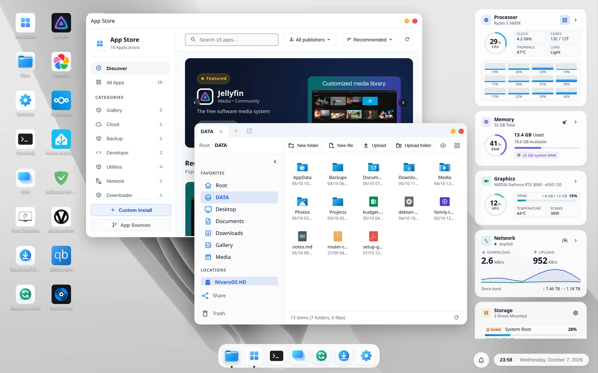
  </picture>
  <br><sub>The web desktop: windowed apps, live hardware widgets and a dock, in light and dark.</sub>
</p>

<table>
  <tr>
    <td width="50%" align="center">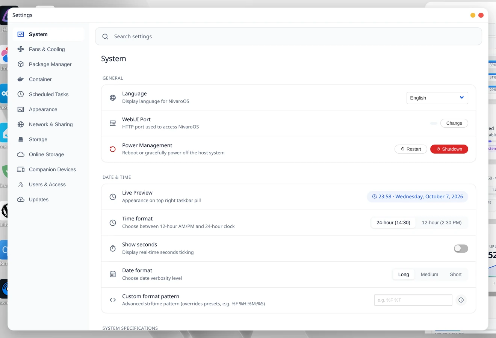<br><sub><b>Settings</b>: system, fans, packages, storage, users and updates in one place</sub></td>
    <td width="50%" align="center">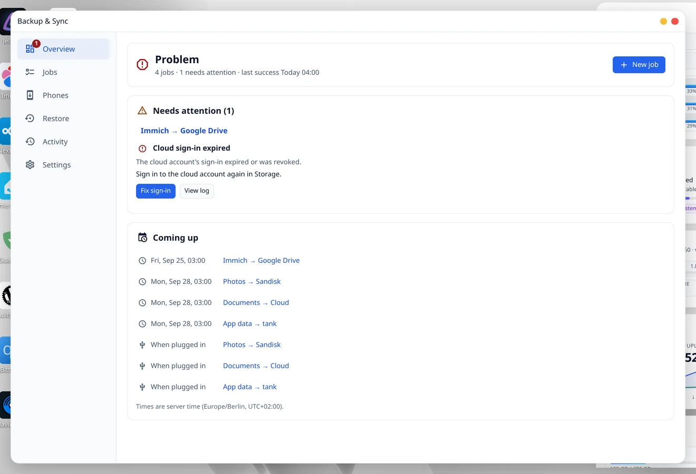<br><sub><b>Backup &amp; Sync</b>: jobs to drives, clouds and phones, with clear problems and schedules</sub></td>
  </tr>
  <tr>
    <td width="50%" align="center">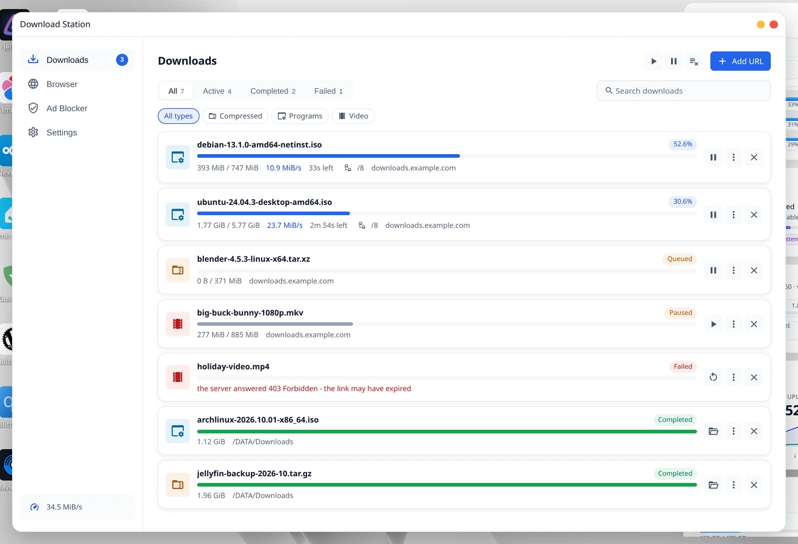<br><sub><b>Download Station</b>: multi-connection downloads straight to your drives</sub></td>
    <td width="50%" align="center">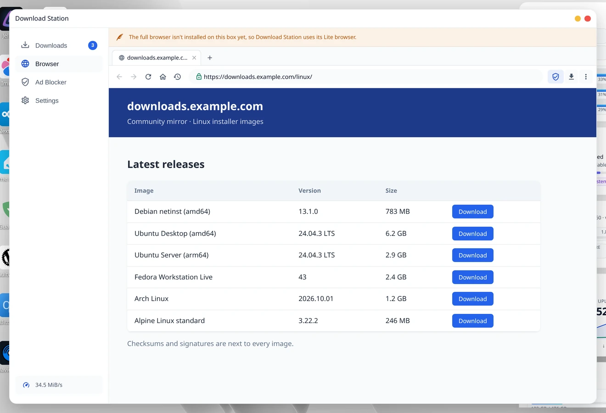<br><sub><b>Download Station browser</b>: browse on the server, downloads land on the server</sub></td>
  </tr>
  <tr>
    <td width="50%" align="center">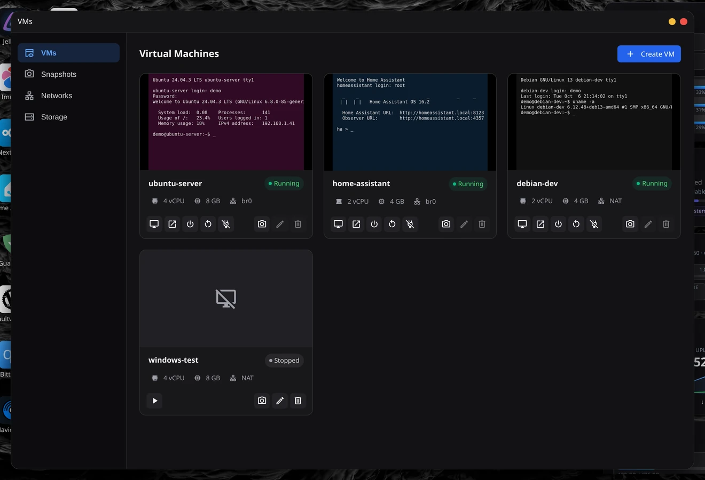<br><sub><b>Virtual machines</b>: KVM guests with live previews, consoles and snapshots</sub></td>
    <td width="50%" align="center">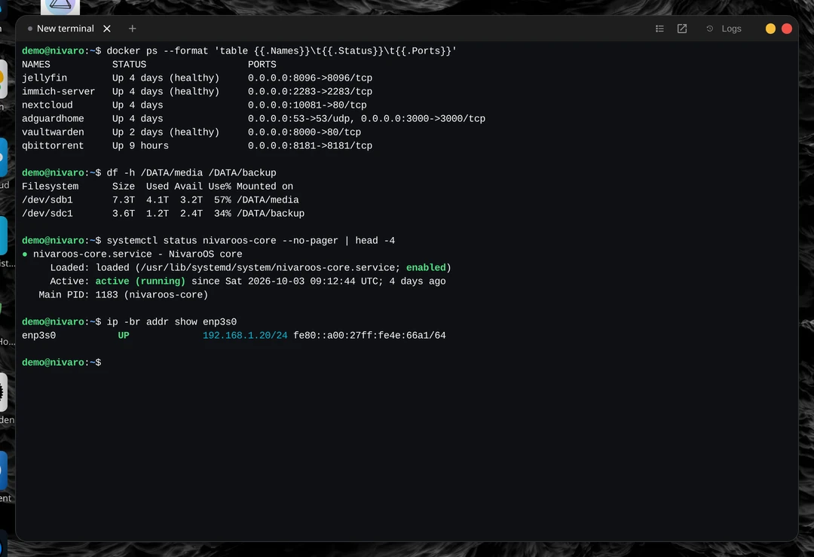<br><sub><b>Terminal</b>: persistent shell sessions in the browser</sub></td>
  </tr>
</table>

### 📱 Android app

<table>
  <tr>
    <td width="25%" align="center">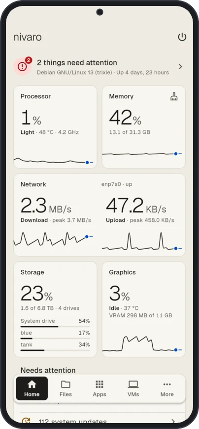<br><sub><b>Home</b></sub></td>
    <td width="25%" align="center">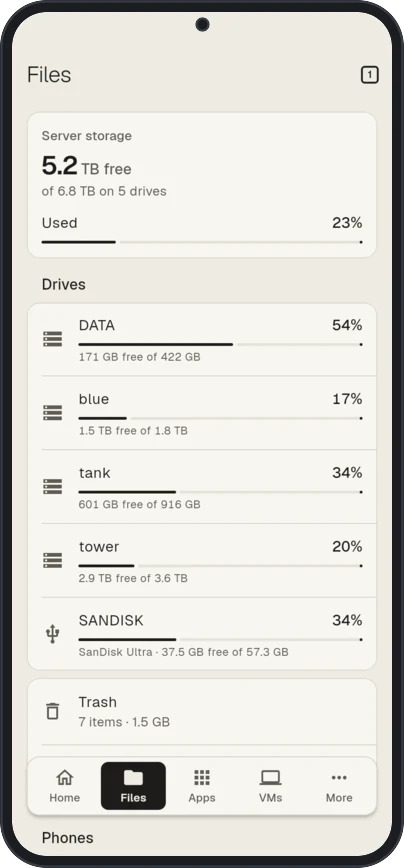<br><sub><b>Files</b></sub></td>
    <td width="25%" align="center">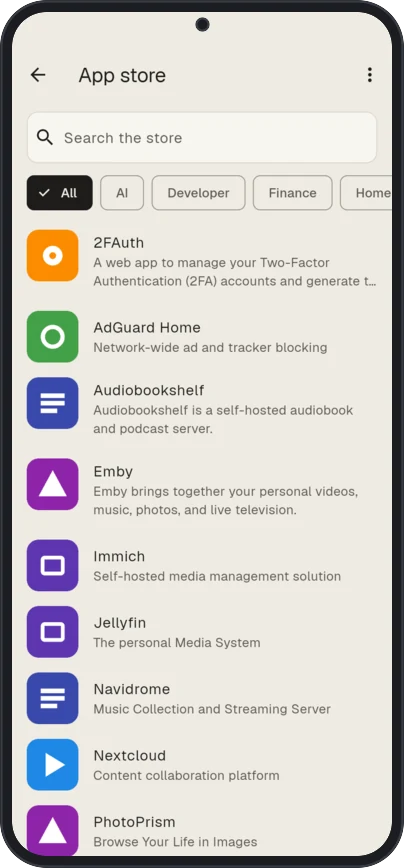<br><sub><b>App Store</b></sub></td>
    <td width="25%" align="center">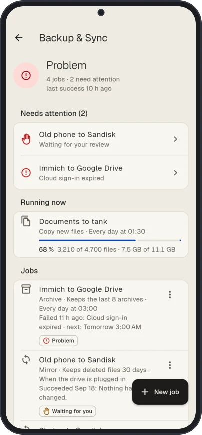<br><sub><b>Backup &amp; Sync</b></sub></td>
  </tr>
  <tr>
    <td width="25%" align="center">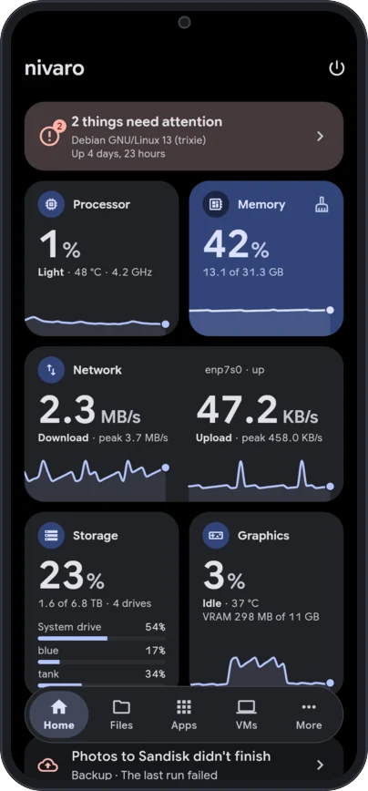<br><sub><b>Home</b> · Tonal, true black</sub></td>
    <td width="25%" align="center">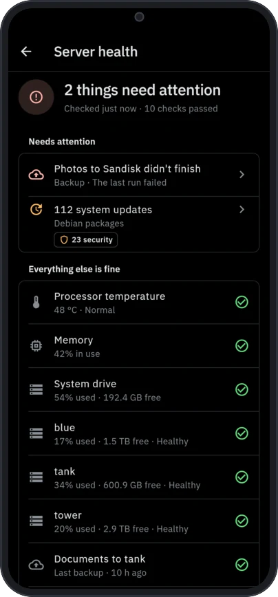<br><sub><b>Server health</b> · Console</sub></td>
    <td width="25%" align="center">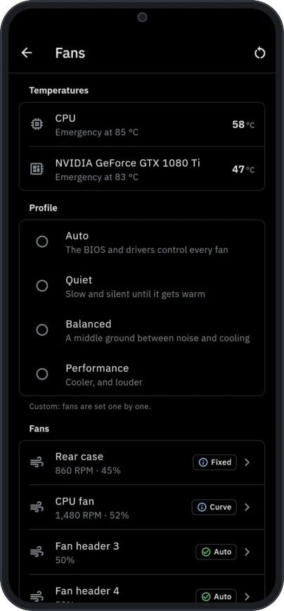<br><sub><b>Fans</b> · Console</sub></td>
    <td width="25%" align="center">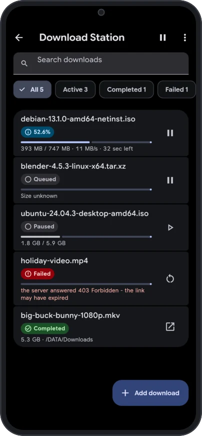<br><sub><b>Download Station</b> · Tonal</sub></td>
  </tr>
</table>

<p align="center"><sub>The app ships three looks (Rack, Tonal, Console), each in light, dark and true black. All screenshots use made-up demo data; see <a href="docs/images/screenshots/README.md">how they are made</a>.</sub></p>

---

## ✨ Features

### 🖥️ Web desktop
- Windowed apps you can move, resize, snap and pin to the dock; windows reopen at the size you last gave them, and open tabs survive reloads and updates.
- Live widgets for CPU, memory (with *Free up memory*), storage, network (IPs, totals, LAN and internet speed tests), GPU (NVIDIA and AMD) and fans.
- Wallpapers, light and dark themes, adjustable transparency and blur, a notification center, and profile pictures shown wherever your account is.

### 📁 Files
- Tabs with a shared clipboard, drag and drop, a single Transfers panel, and fast, reliable copy / move / upload.
- **Trash** with Undo, restore and 30-day purge.
- **Cloud drives** mounted as folders: Google Drive, OneDrive, Dropbox, iCloud Drive, TeraBox, WebDAV, SFTP, SMB, S3-compatible and Backblaze B2. Their cache lives on disk, with settings for mode, size, age and location.
- **Phones** show up as storage: browse, stream and transfer files on a paired Android phone, at home or away (over Tailscale or the app's tunnel).
- Previews for video (seekable streaming), audio, images, PDF, Office documents, code and Markdown.
- **Share links**: one-time, password-protected or expiring links, and folders shared as a ZIP.

### 📦 Apps
- **App Store** with community catalogs and custom app sources.
- **Compose editor** that keeps your Compose file intact while you edit it as a form or as YAML; import Compose files or convert `docker run` commands.
- **Edit app**: name, icon, Web UI link, image/tag and settings of an installed app; container updates for registry, local and GitHub builds.
- **Container terminals** with a shell of your choice, and **persistent terminal sessions**: close the window, come back later, and the session and its scrollback are still there.

### 🧩 Virtual machines & Host Desktop
- **KVM / QEMU** virtual machines with live previews, an in-browser console with a clipboard panel, snapshots, shared folders and NivaroOS Guest Tools.
- **Host Desktop** streams the server's own desktop over VNC, with frame-rate control and a whole-frame capture option for smoother video.

### 💾 Backup & Sync
- Scheduled backup and sync jobs to other drives, network shares or cloud accounts, with versions, restore, and clear status and problem reports.
- **Encrypted backups**: an encrypted folder (rclone crypt, file and folder names hidden) or a 7z archive (AES-256) split into volumes under the 4 GB file limit of FAT32 drives. A **recovery key** is made when the job is created.
- **Phone backup** from the Android app: photos, files, contacts, calendar, SMS, call log and the list of installed apps, to a location you pick on the server.

### ⬇️ Download Station
- Multi-connection downloads straight to your drives, with speed limits, an ad blocker and a Lite browser mode.
- A real browser that runs **on the server** (sandboxed Chromium, streamed to your window): what you download there lands on the server. TeraBox sign-in through that browser.
- **Torrents** through a qBittorrent engine (`qbittorrent-nox`, started only while a torrent is active, or your own qBittorrent, or a built-in engine): magnet links, .torrent files and watch folders, file selection and priorities, seeding limits, schedules, and a best-trackers list that updates itself and is never added to private torrents.

### 🌡️ Hardware & health
- **Fan control** for motherboard, AMD GPU, laptop and Raspberry Pi fans (hwmon) and NVIDIA GPUs (NVML): Auto / Fixed / Curve per fan, with a drag-to-edit curve and Quiet / Balanced / Performance profiles. Safety first: never below 20%, full speed at the emergency temperature, and every fan goes back to BIOS control if the service stops.
- **Server health** in the Android app: one place that lists what needs attention.
- Settings for storage, disks and pools, SMB shares, users, system packages and updates.

### 🔐 Security & remote access
- Sessions end everywhere on a password change; *Sign out other devices*; removed phones are signed out.
- Saved secrets are sealed at rest; login attempts are rate-limited.
- A **watchdog** restarts or rolls back failed services after an update, and NivaroOS services are the last thing the OOM killer takes.
- **Tailscale** setup from Settings (install, sign in, SSH, exit node); works behind **Cloudflare Tunnel**, Tailscale Funnel or a reverse proxy.

---

## 📱 Android companion app

The companion app (Flutter, in [`mobile/`](mobile/)) puts the server in your pocket:

- **Home** with widgets (refresh down to 1 second or *Real time*) and **Server health**.
- **Files** with tabs, Trash, cloud drives, share links with QR codes, and your phone's own storage shared with the server.
- **Host Desktop** and VM consoles in the style of Microsoft's Windows App: trackpad or touch, keyboard with modifier keys, clipboard.
- **Download Station**: every download and torrent; share a link or magnet from any app to *Download on server*, or a file to *Upload to NivaroOS*.
- **Backup & Sync** jobs and runs, and **phone backup** of photos, files, contacts, calendar, SMS, call log and apps.
- **Fans**, **App Store** and **Edit app**, and **terminal sessions** that survive.
- Three styles (Rack, Tonal, Console) in light, dark and true black; app lock.

**Install:** download `NivaroOS.apk` from the [latest release](https://github.com/F-e-n-y-x/NivaroOS/releases/latest) and open it on your phone (allow installing from your browser or file manager when Android asks). The app finds NivaroOS servers on your network. Updates install from inside the app, which checks the APK's SHA-256 and that it is signed with the same key before installing. Requires Android 7.0 or newer.

---

## ⚡ Install

On a **Debian 11+** or **Ubuntu 20.04+** machine (also Raspberry Pi OS, Linux Mint, Pop!_OS and other Debian-based systems), amd64 or arm64:

```bash
curl -fsSL https://raw.githubusercontent.com/F-e-n-y-x/NivaroOS/master/installer/install.sh | sudo bash
```

The installer asks which components you want (or takes the defaults with `-y`), builds NivaroOS from source and starts it. Then open `http://<your-server-ip>` and create your account.

To pass flags, use `| sudo bash -s -- <flags>`:

| Flag | What it does |
| :--- | :--- |
| `-y`, `--yes` | Non-interactive: accept the defaults, no selection menu |
| `--with-vm` / `--without-vm` | VM Manager with QEMU/KVM, libvirt and the web console |
| `--with-host-desktop` / `--without-host-desktop` | Host Desktop streaming over VNC (needs VM Manager) |
| `--with-download-station` / `--without-download-station` | Download Station (default: on) |
| `--without-ds-browser` | Keep Download Station's browser in Lite mode (no Chromium) |
| `--without-ds-torrent` | Don't install `qbittorrent-nox` (torrents use the built-in engine) |
| `--with-backup` / `--without-backup` | Backup & Sync (default: on) |
| `--port <port>` | Dashboard port (default: 80, or the next free port) |
| `--branch <branch>` | Git branch or tag to install (default: `master`) |
| `--force` | Upgrade even while a backup is running (it is retried afterwards) |
| `--debug` | Verbose logs |
| `-h`, `--help` | All options |

---

## 🔄 Updating and recovery

**Updating:** re-run the install command. It updates in place and keeps your data, apps and settings. The previous build is kept, and the watchdog rolls back on its own if the new one fails to start.

From a shell (SSH on the LAN or over Tailscale), even when the dashboard is down:

```bash
sudo nivaroos-rollback                     # list what can be rolled back
sudo nivaroos-rollback all                 # put the previous build of everything back
sudo nivaroos-rollback www                 # only the web dashboard

sudo nivaroos-recover status               # services, remote access, recent watchdog actions
sudo nivaroos-recover unlock               # clear login lockouts
sudo nivaroos-recover reset-password <user>
sudo nivaroos-recover restart              # restart every NivaroOS service
```

---

## ⌨️ Command line

`nivaroos-cli` manages NivaroOS without the web UI:

```bash
nivaroos-cli --help
nivaroos-cli vm enable | disable              # VM Manager (VM disks under /DATA/VMs are kept)
nivaroos-cli host-desktop enable | disable    # Host Desktop streaming
nivaroos-cli app-management list apps         # apps, app stores, install / update / logs
nivaroos-cli healthcheck services             # service status, ports in use, logs
```

---

## 🛠️ Building from source

The installer builds everything from source; to build by hand you need:

- **Go** 1.26+ (the installer fetches it if needed)
- **Node.js** 18+ and **pnpm** 9
- **Flutter** 3.47+ for the Android app

```bash
# Web UI -> ui/build/sysroot/var/lib/nivaroos/www/
cd ui && pnpm install && pnpm run build

# Services (Go workspace): one binary per module
cd services/core && go build -o nivaroos .
#   likewise: gateway, user, app-management, local-storage, message-bus,
#   gpu-sidecar, fans, backup, download-sidecar, vm-sidecar, and cli/

# Android app -> mobile/build/app/outputs/flutter-apk/app-release.apk
cd mobile && flutter pub get && flutter build apk --release
```

---

## 💚 Support NivaroOS

NivaroOS is free, open source and built in spare time. If it runs your home server, saves you a subscription, or you just like where it's going, you can chip in — every contribution goes into development time and test hardware.

### 🌍 Anywhere in the world — GitHub Sponsors

Monthly or one-time, by card, straight through GitHub (no fee taken by GitHub).

<p align="center">
  <a href="https://github.com/sponsors/F-e-n-y-x"></a>
</p>

### 🇮🇳 In India — UPI

<p align="center">
  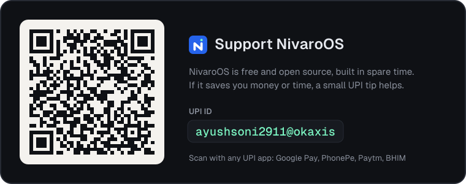
</p>

| | |
| :--- | :--- |
| **UPI ID** | `ayushsoni2911@okaxis` |
| **Name** | Ayush Soni |
| **Apps** | Google Pay, PhonePe, Paytm, BHIM or any UPI app (India) |

Can't send money? Starring the repo, [reporting a bug](https://github.com/F-e-n-y-x/NivaroOS/issues) or sharing NivaroOS with a friend helps just as much.

---

## 🙏 Acknowledgments

NivaroOS is a fork of [CasaOS](https://github.com/IceWhaleTech/CasaOS), originally created by [IceWhaleTech](https://github.com/IceWhaleTech). Thank you to the original CasaOS team and community for the foundation this project was built on.

Created by **Ayush** ([@F-e-n-y-x](https://github.com/F-e-n-y-x)), with contributions from the NivaroOS community.

---

## 📄 License

Distributed under the **Apache 2.0 License**. See [`LICENSE`](LICENSE).
